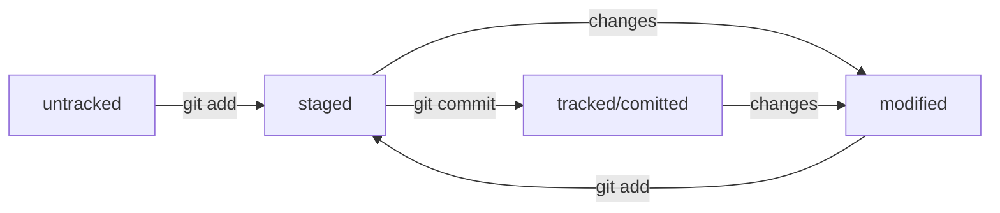

# Директория хранения технических заданий департамента РЗА

#### Перечень документов, хранящихся в директории:

* Техническое задание на разработку микропроцессорного терминала РЗА;
* Техническое задание на разработку ИКЗ ВЛ 6-35 кВ;
* Техническое задание на разработку ИКЗ КЛ 6-35 кВ;
* Техническое задание на разработку устройства резервной защиты трансформатора - устройства резервирования отказа системы оперативного тока на подстанции;


# Инструкция по работе с Git
## Перечень основных команд:

### Работа с репозиторием:

* **Инициализация репозитория:**
```
$ git init
```
* **Деинициализация репозитория:**
```
$ rm -rf .git
```
* **Проверить состояние репозитория:**
```
$ git status
```

### Работа с файлами:

* **Добавить файл в репозиторий:**
```
# Добавить один файл:
$ git add *имя_файла*

# Добавить все файлы:
$ git add --all
```
* **Сделать коммит:**
```
$ git commit -m 'Мой первый коммит!'
# Если ввести git commit без флага -m, откроется редактор Vim. 
# Чтобы выйти из него, нажмите клавишу Esc, наберите последовательность 
# символов :q! и нажмите Enter.
```
* **Просмотреть историю коммитов:**
```
$ git log
```

### Работа с GitHub:

#### Команды для SSH:

* **Вывести список созданных ключей:**
```
# Эта команда покажет содержимое папки .ssh:
$ ls -la .ssh/

# Эта команда покажет содержимое папки .ssh в виде списка файлов:
$ ls -a ~/.ssh
```
* **Генерация SSH-ключей:**
```
# Генерация через алгоритм шифрования ed25519:
$ ssh-keygen -t ed25519 -C "электронная почта, к которой привязан ваш аккаунт на GitHub"

# Генерация через другой алгоритм:
$ ssh-keygen -t rsa -b 4096 -C "электронная почта, к которой привязан ваш аккаунт на GitHub"
```

* **Копирование содержимого ключей:**
```
# Для MacOS:
 # скопировать содержимое ключа в буфер обмена:
 $ pbcopy < ~/.ssh/id_rsa.pub
 # для ed25519:
 $ pbcopy < ~/.ssh/id_ed25519.pub
 
# Для Windows:
 # скопировать содержимое ключа в буфер обмена:
 $ clip < ~/.ssh/id_rsa.pub
 # для ed25519:
 $ clip < ~/.ssh/id_ed25519.pub
```

* **Проверка правильности ключа:**
```
$ ssh -T git@github.com
```

#### Команды для работы в репозиториях Git и GitHub:

* **Привязать удалённый репозиторий к локальному:**
```
$ cd ~/dev/first-project
$ git remote add origin git@github.com:%ИМЯ_АККАУНТА%/first-project.git
```

* **Убедиться, что репозитории связаны:**
```
$ git remote -v
```

* **Отправить изменения на удалённый репозиторий:**
```
# В первый раз:
$ git push -u origin main # Если команда приведёт к ошибке, попробуйте 
                          # заменить main на master.

# В последующих итерациях:
$ git push
```

* Скопировать с удалённого на локальный реепозиторий:
```
$ git clone git@github.com:%ВАШ_АККАУНТ%/git-basics.git
# укажите адрес репозитория
```


